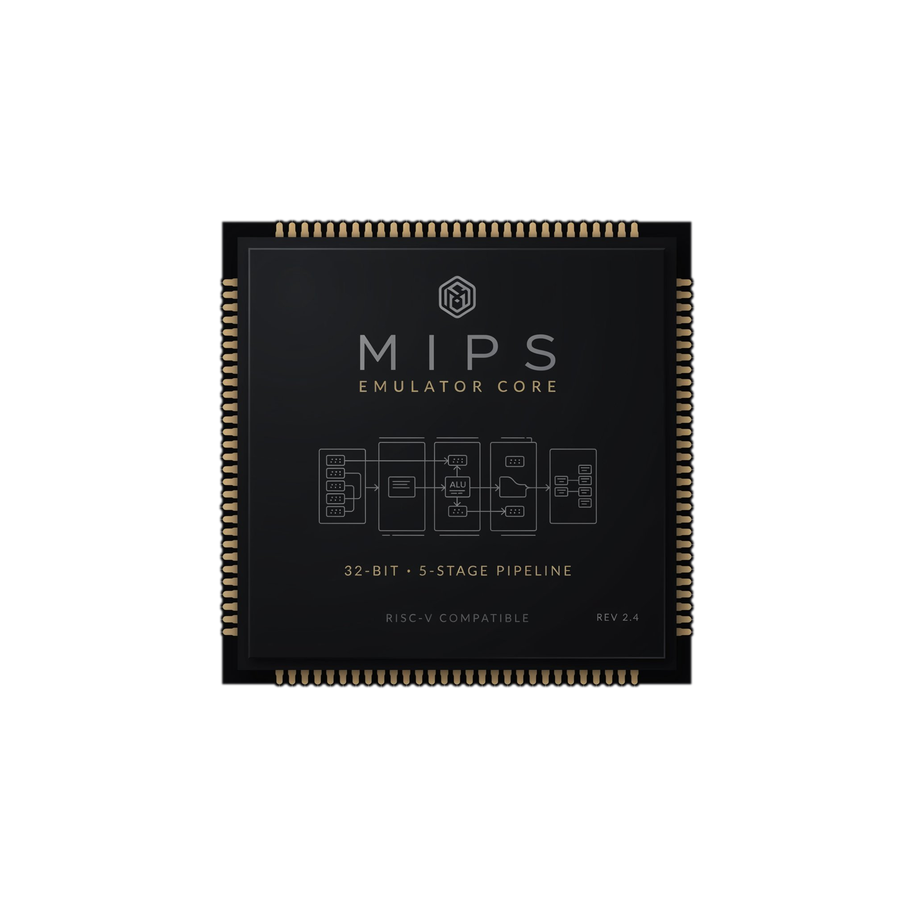

<p align="center">
  
</p>

# MIPS CPU Emulator

This project is a comprehensive C++20 application that started as a live terminal number system converter (binary, hex, decimal) and has evolved into a sophisticated **pluggable MIPS CPU emulator**. It features interchangeable processor models—single-cycle and 5-stage pipelined—and a detailed datapath visualizer.

Built using [FTXUI](https://github.com/ArthurSonzogni/FTXUI), the architecture is designed around the **Ripes/DrMIPS pattern**: an abstract `IProcessor` interface allows single-cycle and pipelined implementations to be swapped out seamlessly without requiring UI changes. The processor exposes `PipelineState`, enabling the visualizer to display both models identically across all stages (IF, ID, EX, MEM, WB).


## ✨ Key Features

*   **Live Number Conversion:** Instant two-way conversion between binary, hex, and decimal bases.
*   **CPU Mode Switching:** Toggle between single-cycle and 5-stage pipelined CPUs at runtime.
*   **Pipeline Visualization:** Monitor all five stages of the CPU cycle by cycle, including forwarding paths and hazard flags.
*   **MIPS Instruction Decoding:** Input a raw 32-bit value to see its corresponding mnemonic instantly.
*   **Data Integrity:** Conversion is backed by a single `uint64_t` source of truth with robust input validation.
*   **Control & Navigation:** Fully keyboard-driven (`Tab` to navigate, `F10` to step, `Esc` to quit).

## 🚀 Quick Start

### Build
The build is fully self-contained via CMake FetchContent (FTXUI v7.0.0).

```bash
cmake -S . -B cmake-build-debug
cmake --build cmake-build-debug --target number_system_converter
```

### Run
> ⚠️ **Important:** FTXUI requires a real terminal environment to render correctly due to ANSI escape codes. If running in an IDE, ensure "Emulate terminal in output console" is enabled or run directly from the shell.

```bash
./cmake-build-debug/number_system_converter
```


Start by entering `255` in DEC and observing HEX (`FF`) and BIN (`11111111`) update live.

### Testing
Run all unit and integration tests:

```bash
cmake --build cmake-build-debug --target decoder_test cpu_test processor_test nsc_tests
ctest --test-dir cmake-build-debug --output-on-failure
```


## 🧠 Technical Architecture Overview

The system is split into two decoupled core parts: `nsc_core` (Number System Converter) and `mips_core` (CPU Emulator).

### MIPS Core: Pluggable Processors (`mips/`)
The `IProcessor` interface serves as the contract between the UI frontend and any execution engine. This pattern supports both models equally.

*   **SingleCycleCpu:** Implements a basic, non-pipelined datapath (H&H Chapter 7).
*   **PipelinedCpu:** Full 5-stage pipeline implementation (IF, ID, EX, MEM, WB) adhering to H&H Chapter 8 principles. It includes complex logic for:
    *   Load-use stall detection.
    *   Forwarding paths (EX/MEM → EX and MEM/WB → EX).
    *   Hazard detection and control flow resolution (Branch/Jump flushes).

### Core Module Responsibilities

| Module               | Responsibility                                                                       | NSC Core | MIPS Core |
|:---------------------|:-------------------------------------------------------------------------------------|:---------|:----------|
| **Converter**        | Manages `uint64_t` state, exposes base views.                                        | ✅        |           |
| **Parser/Formatter** | String validation and serialization across bases.                                    | ✅        |           |
| **IProcessor**       | Abstract interface for execution engine and visualizer contract.                     |          | ✅         |
| **CPUs (SC/Pipe)**   | The core CPU implementation logic (datapath).                                        |          | ✅         |
| **Decoder / ALU**    | Instruction format detection, control signal generation, arithmetic/logic execution. |          | ✅         |

## 🧱 Design Conventions & Built With

*   **Languages/Tools:** C++20 (`std::format`, `std::optional`), FTXUI v7.0.0, CMake FetchContent.
*   **Design Focus:** Modular design where `mips_core` and `nsc_core` contain pure logic; the UI layer never includes core libraries. Polymorphism via `IProcessor` ensures backend flexibility.

## 📄 Documentation

To understand this project in depth, consult our documentation guides:

*   **🚀 For Beginners:** Start with [USER_GUIDE.md](docs/USER_GUIDE.md) to learn MIPS concepts through the TUI visualization.
*   **🧠 For Developers:** Review [ARCHITECTURE_DESIGN.md](docs/ARCHITECTURE_DESIGN.md) for a detailed breakdown of design patterns and hardware abstractions.
*   **⚙️ For Contributors:** Follow the rules in [CONTRIBUTING.md](docs/CONTRIBUTING.md) before submitting code.


## 📄 License

See [LICENSE](LICENSE) file