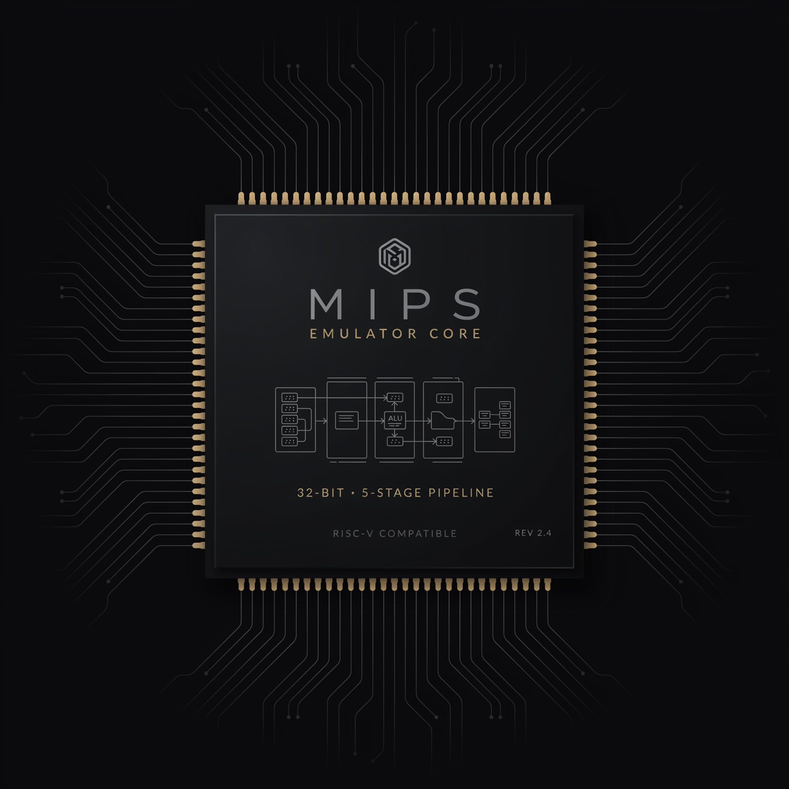

<div style="text-align: center;">
  
</div>

<div style="text-align: center;">

```
 ██████╗██╗     ███████╗ █████╗ ██████╗  ██████╗ ██████╗ ██████╗ ███████╗
██╔════╝██║     ██╔════╝██╔══██╗██╔══██╗██╔════╝██╔═══██╗██╔══██╗██╔════╝
██║     ██║     █████╗  ███████║██████╔╝██║     ██║   ██║██████╔╝█████╗
██║     ██║     ██╔══╝  ██╔══██║██╔══██╗██║     ██║   ██║██╔══██╗██╔══╝
╚██████╗███████╗███████╗██║  ██║██║  ██║╚██████╗╚██████╔╝██║  ██║███████╗
 ╚═════╝╚══════╝╚══════╝╚═╝  ╚═╝╚═╝  ╚═╝ ╚═════╝ ╚═════╝ ╚═╝  ╚═╝╚══════╝
```

**A pure C++20 terminal lab for computer architecture: from number bases to MIPS hardware, all in one TUI.**

</div>

<div style="text-align: center;">


</div>

---

This project started as a live terminal number system converter (binary, hex, decimal) and evolved through deliberate stages into a **pluggable MIPS CPU emulator**. It features interchangeable processor models — single-cycle and 5-stage pipelined — driven by a single `IProcessor` interface, with a cycle-accurate pipeline visualizer and hazard/forwarding badges.

Built on [FTXUI](https://github.com/ArthurSonzogni/FTXUI), the architecture follows the **Ripes/DrMIPS pattern**: the abstract `IProcessor` interface lets `SingleCycleCpu` and `PipelinedCpu` implementations swap in and out without touching the UI layer. Both expose the same `PipelineState`, so the visualizer renders single-cycle and pipelined execution identically across IF, ID, EX, MEM, and WB.

## ✨ Key Features

- **Live Number Conversion** — instant two-way conversion between binary, hex, and decimal, backed by a single `uint64_t` source of truth with robust input validation.
- **CPU Mode Switching** — toggle between single-cycle and 5-stage pipelined CPUs at runtime, no rebuild required.
- **Pipeline Visualization** — all five stages rendered cycle by cycle, with color-coded forwarding paths (EX→EX, WB→EX) and hazard badges (load-use stall, branch/jump flush).
- **MIPS Instruction Decoding** — enter a raw 32-bit value and see its mnemonic, register fields, and binary breakdown decoded live.
- **Telemetry & CPI** — running cycle counters, stall/forward/flush tallies, and a live CPI readout.
- **Signal Monitor** — an ambient oscilloscope panel that animates while the CPU runs. (A schematic single-cycle *datapath* view is planned — see the roadmap.)
- **Control & Navigation** — fully keyboard-driven (`Tab` to move between panels, `F10` to step, `Esc` to quit).

## 🖥️ Tabs

| # | Tab                | Purpose                                              |
|---|--------------------|------------------------------------------------------|
| 0 | **Converter**      | Live binary/hex/decimal conversion                   |
| 1 | **CPU Dashboard**  | Registers, pipeline stages, hazard badges, telemetry |
| 2 | **CPU Config**     | Switch between single-cycle and pipelined backends   |
| 3 | **Program Loader** | Load a flat instruction-word program into memory     |
| 4 | **Signal Monitor** | Ambient oscilloscope animation during execution      |

## 🚀 Quick Start

### Build
The build is fully self-contained via CMake FetchContent (FTXUI v7.0.0) — no system-wide FTXUI install required.

```bash
cmake -S . -B cmake-build-debug
cmake --build cmake-build-debug --target number_system_converter
```

### Run
> ⚠️ **Important:** FTXUI requires a real terminal environment to render correctly due to ANSI escape codes. If running from an IDE, enable "Emulate terminal in output console" or run directly from the shell.

```bash
./cmake-build-debug/number_system_converter
```

Start by entering `255` in DEC and watch HEX (`FF`) and BIN (`11111111`) update live.

### Testing
95/95 checks passing across the decoder, both CPU backends, and the converter core.

```bash
cmake --build cmake-build-debug --target decoder_test cpu_test processor_test nsc_tests
ctest --test-dir cmake-build-debug --output-on-failure
```

## 🧠 Technical Architecture

The system is split into two decoupled core libraries plus a UI layer, all wired together with CMake:

- **`nsc_core`** — the number system converter logic.
- **`mips_core`** — the processor logic, behind the `IProcessor` interface.
- **`nsc_ui`** — FTXUI wiring; never includes core libraries directly, only their public interfaces.

### MIPS Core: Pluggable Processors (`mips/`)
`IProcessor` is the contract between the UI and any execution engine, so both backends are interchangeable:

- **`SingleCycleCpu`** — a basic, non-pipelined datapath (H&H Chapter 7).
- **`PipelinedCpu`** — a full 5-stage pipeline (IF, ID, EX, MEM, WB) adhering to H&H Chapter 8, including:
  - Load-use stall detection
  - Forwarding paths (EX/MEM → EX and MEM/WB → EX)
  - Hazard detection and control-flow resolution (branch/jump flushes)

### Core Module Responsibilities

| Module               | Responsibility                                                  | NSC Core | MIPS Core |
|:---------------------|:----------------------------------------------------------------|:--------:|:---------:|
| **Converter**        | Manages `uint64_t` state, exposes base views                    |    ✅     |           |
| **Parser/Formatter** | String validation and serialization across bases                |    ✅     |           |
| **IProcessor**       | Abstract interface for execution engine + visualizer contract   |          |     ✅     |
| **CPUs (SC/Pipe)**   | Core CPU implementation logic (datapath)                        |          |     ✅     |
| **Decoder / ALU**    | Instruction format detection, control signals, arithmetic/logic |          |     ✅     |

### Design Conventions & Built With
- **Languages/Tools:** C++20 (`std::format`, `std::optional`), FTXUI v7.0.0, CMake FetchContent.
- **Design Focus:** `mips_core` and `nsc_core` contain pure logic with no UI dependency; polymorphism via `IProcessor` keeps backends swappable; `enum class` for hardware fields; `[[nodiscard]]` on pure queries.

## 🌍 Ecosystem Positioning

ClearCore sits alongside established educational and research simulators, applying the Ripes pluggable-backend pattern to a terminal-native MIPS implementation:

| Aspect            | ClearCore                | Ripes              | DrMIPS          | EduMIPS64       | QtMips            | WebRISC-V   |
|-------------------|--------------------------|--------------------|-----------------|-----------------|-------------------|-------------|
| **Language**      | C++20                    | C++/Qt             | Java            | Java            | C++/Qt            | PHP/JS      |
| **UI**            | FTXUI (TUI)              | Qt (GUI)           | Swing (GUI)     | Swing (GUI)     | Qt (GUI)          | Web Browser |
| **ISA**           | MIPS                     | RISC-V             | MIPS            | MIPS64          | MIPS              | RISC-V      |
| **Backends**      | 2 (SC / 5-stage)         | 5+ models          | ~2              | ~1              | ~1                | ~1          |
| **Visualization** | Pipeline state + hazards | Datapath schematic | Visual datapath | Register/memory | Datapath + memory | Cycle grid  |

Reference texts: **Harris & Harris**, *Digital Design and Computer Architecture* (single-cycle datapath, control signal generation), and **Patterson & Hennessy**, *Computer Organization and Design* (pipelining, hazards, forwarding).

## 🗺️ Roadmap

- ✅ **Stage 1** — Number converter core + MIPS decoder
- ✅ **Stage 1.5** — `IProcessor` refactor, single-cycle and pipelined backends
- 🟡 **Stage 2** — TUI execution visualizer (memory panel, instruction decode, hazard badges, speed controls, telemetry — complete)
- ⬜ **Stage 3** — Two-pass assembler with symbol table, label resolution, pseudo-instructions
- ⬜ **Stage 4** — Instruction × cycle grid, per-stage telemetry, CPI analysis, performance summary panel
- ⬜ **Stage 5** — Branch prediction and speculative execution

See [docs/ROADMAP.md](docs/ROADMAP.md) for the full breakdown.

## 📄 Documentation

- **🚀 For Beginners:** [USER_GUIDE.md](docs/USER_GUIDE.md) — learn MIPS concepts through the TUI visualization.
- **🧠 For Developers:** [ARCHITECTURE_DESIGN.md](docs/ARCHITECTURE_DESIGN.md) — design patterns, hardware abstractions, and academic grounding.
- **⚙️ For Contributors:** [CONTRIBUTING.md](docs/CONTRIBUTING.md) — branching model, code style, and testing guidelines.
- **🗺️ Roadmap:** [ROADMAP.md](docs/ROADMAP.md) — staged feature plan and reference patterns.

## 📄 License

MIT — see [LICENSE](LICENSE).